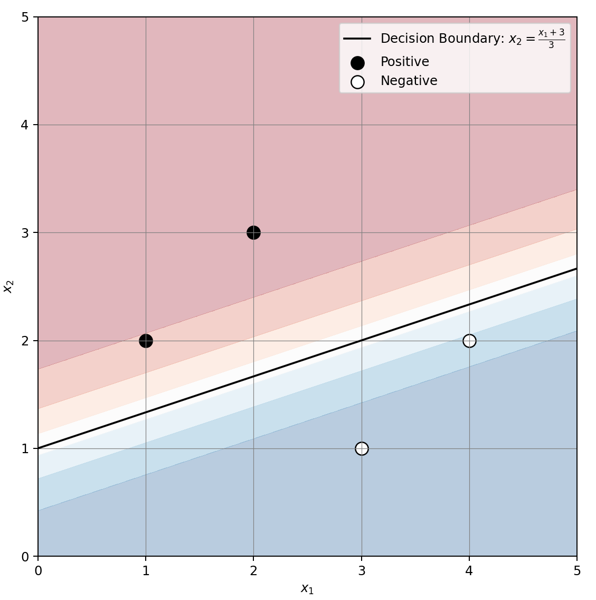

### 3. Logistic Regression (4)

---

우측 그림에 나타난 단순 데이터에 대해 로지스틱 회귀 모델 $h_{\mathbf{w}}(\mathbf{x}) = \frac{1}{1 + e^{-\mathbf{w} \cdot \mathbf{x}}}$를 유도하려고 한다. 여기서 ●와 ○는 각각 positive example과 negative example을 나타낸다. 이 두 차원 데이터에 대해, $\mathbf{w} = (w_0, w_1, w_2)$이고 $\mathbf{x} = (x_0, x_1, x_2)$이며 $x_0 = 1$이다. 또한, 우도(Likelihood) 함수 $P$는 아래와 같이 정의된다.

$$
P(d|h_{\mathbf{w}}) = \prod_j P(d_j|h_{\mathbf{w}}) = \prod_j \hat{p}(\mathbf{x}_j)^{y_j} \left(1 - \hat{p}(\mathbf{x}_j)\right)^{1 - y_j}
$$

---

3-1. 이 모델에 대한 두 가지 파라미터 후보 $\mathbf{w}_1 = (0, -1, 1)$과 $\mathbf{w}_2 = (-3, -1, 3)$에 대해, 우도를 계산하여 비교하여 더 나은 것을 결정하라.

**답:**
- Positive 예제(●): $(1, 2)$, $(2, 3)$
- Negative 예제(○): $(3, 1)$, $(4, 2)$

$\mathbf{w}_1 = (0, -1, 1)$에 대한 우도 계산:
- $(1, 2)$: $\hat{p} = \frac{1}{1 + e^{-(0 \cdot 1 + (-1) \cdot 1 + 1 \cdot 2)}} = \frac{1}{1 + e^{-1}} = 0.731$
- $(2, 3)$: $\hat{p} = \frac{1}{1 + e^{-(0 \cdot 1 + (-1) \cdot 2 + 1 \cdot 3)}} = \frac{1}{1 + e^{-1}} = 0.731$
- $(3, 1)$: $\hat{p} = \frac{1}{1 + e^{-(0 \cdot 1 + (-1) \cdot 3 + 1 \cdot 1)}} = \frac{1}{1 + e^{-(-2)}} = \frac{1}{1 + e^2} = 0.119$
- $(4, 2)$: $\hat{p} = \frac{1}{1 + e^{-(0 \cdot 1 + (-1) \cdot 4 + 1 \cdot 2)}} = \frac{1}{1 + e^{-(-2)}} = \frac{1}{1 + e^2} = 0.119$

$P(d|h_{\mathbf{w}_1}) = 0.731^1 \times 0.731^1 \times (1-0.119)^1 \times (1-0.119)^1 = 0.731 \times 0.731 \times 0.881 \times 0.881 \approx 0.421$

$\mathbf{w}_2 = (-3, -1, 3)$에 대한 우도 계산:
- $(1, 2)$: $\hat{p} = \frac{1}{1 + e^{-(-3 \cdot 1 + (-1) \cdot 1 + 3 \cdot 2)}} = \frac{1}{1 + e^{-2}} = 0.881$
- $(2, 3)$: $\hat{p} = \frac{1}{1 + e^{-(-3 \cdot 1 + (-1) \cdot 2 + 3 \cdot 3)}} = \frac{1}{1 + e^{-4}} = 0.982$
- $(3, 1)$: $\hat{p} = \frac{1}{1 + e^{-(-3 \cdot 1 + (-1) \cdot 3 + 3 \cdot 1)}} = \frac{1}{1 + e^{-(-5)}} = \frac{1}{1 + e^5} = 0.007$
- $(4, 2)$: $\hat{p} = \frac{1}{1 + e^{-(-3 \cdot 1 + (-1) \cdot 4 + 3 \cdot 2)}} = \frac{1}{1 + e^{-(-5)}} = \frac{1}{1 + e^5} = 0.007$

$P(d|h_{\mathbf{w}_2}) = 0.881^1 \times 0.982^1 \times (1-0.007)^1 \times (1-0.007)^1 = 0.881 \times 0.982 \times 0.993 \times 0.993 \approx 0.856$

$\mathbf{w}_2 = (-3, -1, 3)$가 더 좋은 파라미터입니다.

---

3-2. $\mathbf{w}_2 = (-3, -1, 3)$에 대한 결정 경계(Decision Boundary)를 그려라.

**답:**

$\hat{p}(\mathbf{x}) = \frac{1}{1 + e^{-\mathbf{w} \cdot \mathbf{x}}} = 0.5$

$1 + e^{-\mathbf{w} \cdot \mathbf{x}} = 2$  
$e^{-\mathbf{w} \cdot \mathbf{x}} = 1$  
$-\mathbf{w} \cdot \mathbf{x} = 0$  
$\mathbf{w} \cdot \mathbf{x} = 0$

$\mathbf{w}_2 = (-3, -1, 3)$와 $\mathbf{x} = (1, x_1, x_2)$를 대입  
$(-3) \cdot 1 + (-1) \cdot x_1 + 3 \cdot x_2 = 0$  
$-3 - x_1 + 3x_2 = 0$  
$3x_2 - x_1 = 3$  
$x_2 = \frac{x_1 + 3}{3}$

답 : $x_2 = \frac{x_1 + 3}{3}$ 

