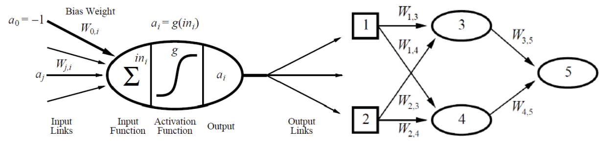

### 4. Multi-Layer Perceptron: Feed-Forward Network (5)

---

아래 좌측 그림은 신경망의 기본 단위인 McCulloch-Pitts Unit을 나타낸다. 요약하면 어떠한 신경망 노드는 편향(bias)을 포함한 모든 입력과 이에 대한 가중치를 곱한 결과를 입력으로 하는 활성화함수(activation function) 값을 출력한다는 의미이다. 이를 참고하여 다음의 물음에 답하여라.

---

4-1. 우측 신경망의 최종 출력 $a_5$를 전개하라. 즉, $a_5$를 입력 $a_1, a_2$와 각 입력의 매개변수(parameter), 활성 함수(activation)를 이용하여 나타내어라. 모든 신경망 노드에서의 활성함수는 $g$로 동일하다고 가정한다. (3)

**답:**

$$
a_3 = g(w_{13}a_1 + w_{23}a_2)
$$
$$
a_4 = g(w_{14}a_1 + w_{24}a_2)
$$

$$
a_5 = g(w_{35}a_3 + w_{45}a_4)
$$

따라서,
$$
a_5 = g\left(w_{35} \cdot g(w_{13}a_1 + w_{23}a_2) + w_{45} \cdot g(w_{14}a_1 + w_{24}a_2)\right)
$$

---

4-2. 우측의 신경망에는 은닉층에 대한 편향(bias)만 존재하며, 각각 $b_1, b_2$라 하면 4-1의 결과는 어떻게 바뀌는가?

**답:**  

$$
a_3 = g(w_{13}a_1 + w_{23}a_2 + b_1)
$$
$$
a_4 = g(w_{14}a_1 + w_{24}a_2 + b_2)
$$

$$
a_5 = g(w_{35}a_3 + w_{45}a_4)
$$

따라서,
$$
a_5 = g\left(w_{35} \cdot g(w_{13}a_1 + w_{23}a_2 + b_1) + w_{45} \cdot g(w_{14}a_1 + w_{24}a_2 + b_2)\right)
$$

