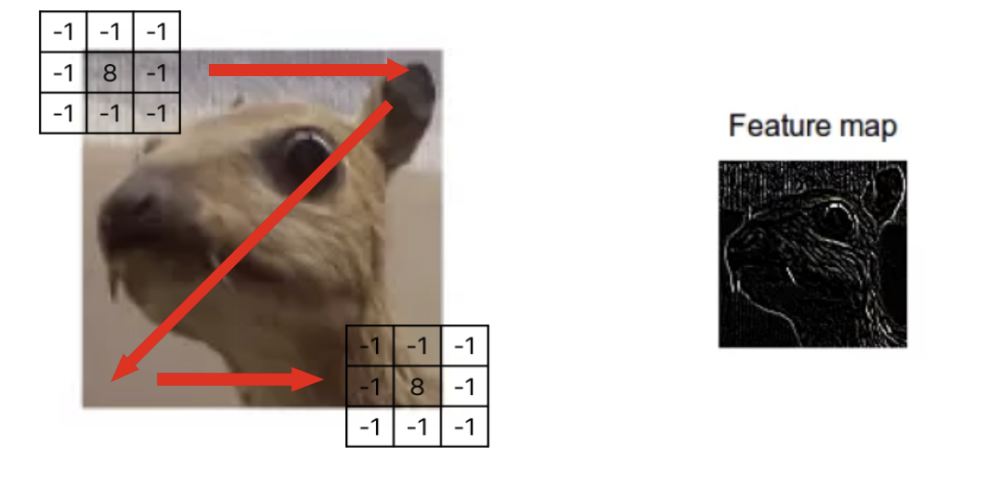

### 5. Deep Neural Networks: DNN, CNN, RNN (6)

---

5-1. 다음과 같은 깊은 신경망이 있다고 가정하자. **입력층 노드 수: 6, 은닉층 노드 수: [5, 4], 출력층 노드 수: 3**. 이 신경망의 총 파라미터 수(가중치와 편향을 모두 포함)를 계산하라. 최종 계산 결과를 도출할 필요는 없으며 곱과 합으로 식을 표현하여도 좋다.  

**답:**

- 입력층(6개 노드: $a_1, a_2, a_3, a_4, a_5, a_6$)에서 첫 번째 은닉층(5개 노드)으로 연결되는 가중치: $w^{(1)}_{ij}$ (i=1,2,...,6; j=1,2,...,5)
  - 가중치 수: $6 \times 5 = 30$개
  - 편향 수: $b^{(1)}_j$ (j=1,2,...,5) = 5개
  
- 첫 번째 은닉층(5개 노드)에서 두 번째 은닉층(4개 노드)으로 연결되는 가중치: $w^{(2)}_{jk}$ (j=1,2,...,5; k=1,2,...,4)
  - 가중치 수: $5 \times 4 = 20$개
  - 편향 수: $b^{(2)}_k$ (k=1,2,...,4) = 4개
  
- 두 번째 은닉층(4개 노드)에서 출력층(3개 노드)으로 연결되는 가중치: $w^{(3)}_{kl}$ (k=1,2,...,4; l=1,2,3)
  - 가중치 수: $4 \times 3 = 12$개
  - 편향 수: $b^{(3)}_l$ (l=1,2,3) = 3개

총 파라미터 수 = $(6 \times 5 + 5) + (5 \times 4 + 4) + (4 \times 3 + 3) = 30 + 5 + 20 + 4 + 12 + 3 = 74$개

---

5-2. 아래 그림은 컨볼루션 연산을 수행하여 특징 지도(Feature Map)를 얻는 과정에 관한 개략적 예시이다. 그림을 참고하여 다음의 물음에 답하라.

입력 이미지가 크기 $64 \times 64$인 특징에 크기 $5 \times 5$인 커널로 컨볼루션 연산을 적용한다. 이후, 풀링 과정을 수행하는데 가능한한 모든 영역의 특징 지도를 얻기 위해 적절한 크기의 패딩(padding)을 수행해야 한다. 그러나 한 구조의 간결성을 위해 보폭(stride)의 크기는 1로 제한한다. 이렇게 생성된 특징 지도의 크기는 얼마인가? 그림을 개략적으로 그리고 결과를 함께 보여라. 커널 연산과 풀링 연산이 되었다가 복원은 동일하다고 가정한다.

**답:**

컨볼루션 연산 후 특징 지도의 크기를 계산하기 위해 다음 공식을 사용합니다:

$출력 크기 = \frac{(입력 크기 - 커널 크기 + 2 \times 패딩)}{스트라이드} + 1$

주어진 조건:
- 입력 이미지 크기: $64 \times 64$
- 커널 크기: $5 \times 5$
- 스트라이드: 1
- 패딩: 계산 필요

출력 크기가 입력 크기와 동일하게 유지되려면(가능한 한 모든 영역의 특징 지도를 얻기 위해):
$64 = \frac{(64 - 5 + 2p)}{1} + 1$

이 식을 풀면:
$64 = 64 - 5 + 2p + 1$
$64 = 60 + 2p$
$4 = 2p$
$p = 2$

따라서 패딩 크기는 2이고, 이를 적용하면:
- 입력 이미지($64 \times 64$)에 패딩(p=2)을 적용하면 $68 \times 68$ 크기가 됩니다.
- 이 이미지에 $5 \times 5$ 커널, 스트라이드 1로 컨볼루션을 적용하면 출력 크기는 $64 \times 64$가 됩니다.

특징 지도의 최종 크기: $64 \times 64$

[개략도]  
입력 이미지(64×64)  
  → 패딩 적용(68×68)  
  → 컨볼루션 연산(5×5 커널, stride=1)  
  → 특징 지도(64×64)

---

5-3. RNN에서 시계열 시퀀스의 길이가 길어진다면 은닉층의 숫자가 1개일 경우라도 Gradient Vanishing 문제가 발생하는 이유는 무엇인가?

**답:**

RNN에서는 시간 단계마다 동일한 가중치 행렬이 반복적으로 곱해지는 구조로 인해 기울기 소실 문제가 발생합니다. 활성화 함수(tanh, sigmoid)의 미분값이 1보다 작아 여러 시간 단계를 거치며 기울기가 급격히 감소합니다. 은닉층이 하나라도 시간적으로 펼쳐진 구조에서는 시퀀스 길이만큼 깊이가 증가하는 효과가 있습니다.

이러한 문제로 인해 시퀀스의 초기 정보가 후반부에 영향을 미치지 못하고 장기 의존성 학습이 어려워집니다. 결과적으로 은닉층의 수와 관계없이 시퀀스 길이가 길어질수록 기울기 소실 문제가 심화되어 학습 성능이 저하됩니다. LSTM이나 GRU와 같은 게이트 메커니즘을 도입한 모델들은 이러한 문제를 완화하기 위해 개발되었습니다.
