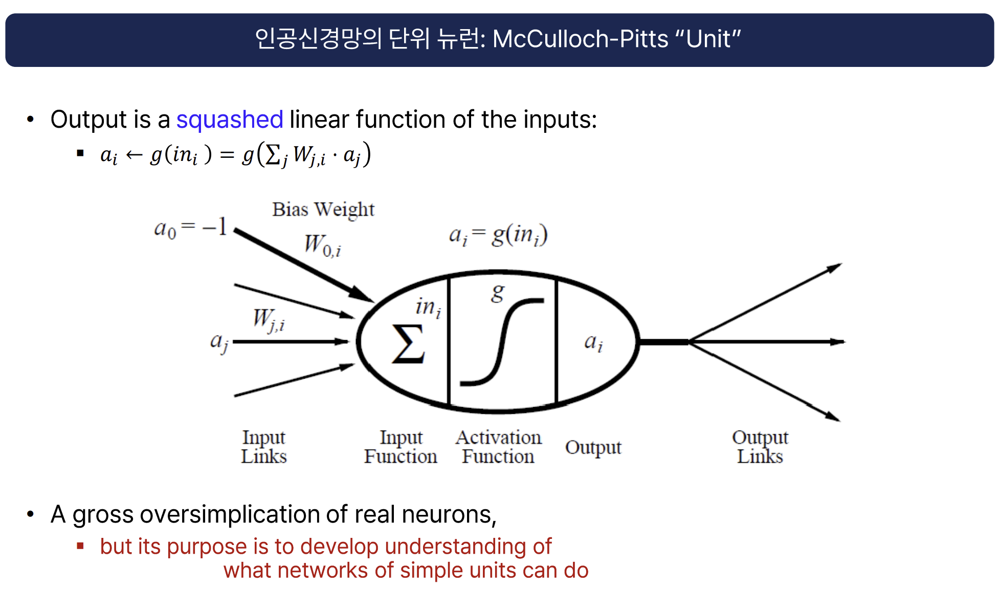

# 인공지능 신경망의 기본 단위: McCulloch-Pitts 뉴런(Unit)

## 개요

- McCulloch-Pitts 뉴런은 인공신경망에서 가장 기본이 되는 계산 단위입니다.
- 입력값들의 가중합을 비선형 함수(activation function)에 통과시켜 출력을 생성합니다.
- 실제 생물학적 뉴런을 매우 단순화한 모델로, 여러 입력을 받아 하나의 출력을 내보냅니다.

---

## 수식 및 구조

- 출력은 입력의 가중합에 활성화 함수를 적용한 형태입니다.

  $$
  o_i = g(in_i) = g\left(\sum_j w_{ij} \cdot a_j\right)
  $$

  - $a_j$: 입력값
  - $w_{ij}$: 입력 $j$에서 뉴런 $i$로의 가중치
  - $g(\cdot)$: 활성화 함수(예: 계단 함수, 시그모이드 등)
  - $in_i$: 입력의 가중합

- 아래 그림은 McCulloch-Pitts 뉴런의 구조를 나타냅니다.

---

---

## 특징 및 목적

- 실제 생물학적 뉴런에 비해 매우 단순화된 모델입니다.
- **목적:** 단순한 유닛들이 모여 어떤 네트워크적 기능을 할 수 있는지 이해하는 데 있습니다.
- 복잡한 신경망의 기본 빌딩 블록으로, 퍼셉트론, 다층 퍼셉트론(MLP) 등 다양한 신경망 구조의 기초가 됩니다.

---

## 참고

- McCulloch, W. S., & Pitts, W. (1943). "A logical calculus of the ideas immanent in nervous activity."
- 실제 신경망 구현 시에는 다양한 활성화 함수와 가중치 조정 방법이 사용됩니다.
